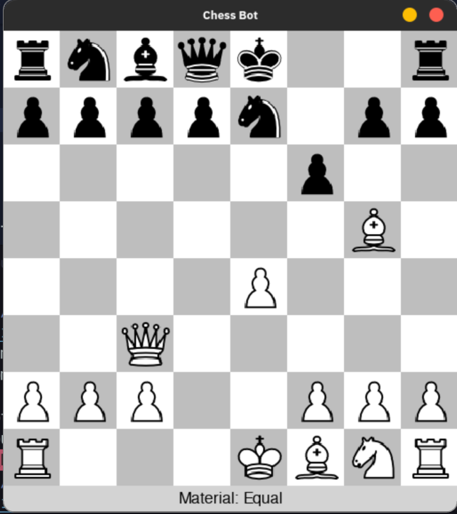
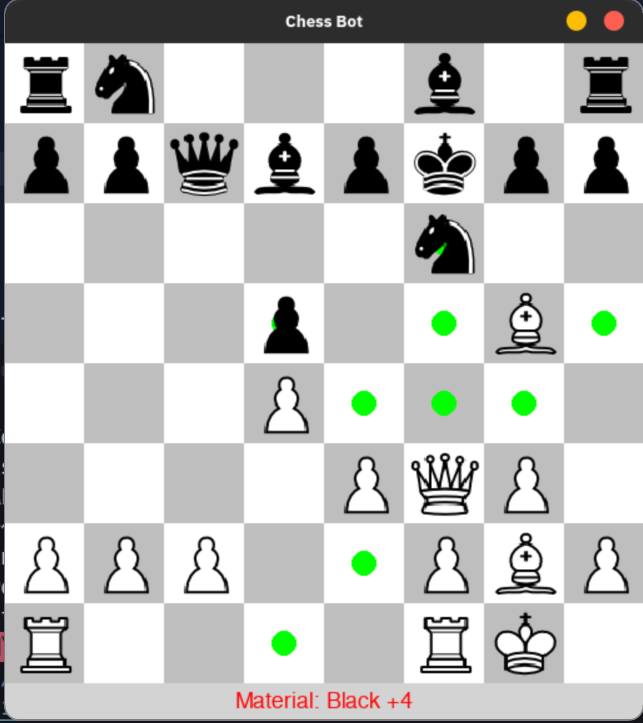
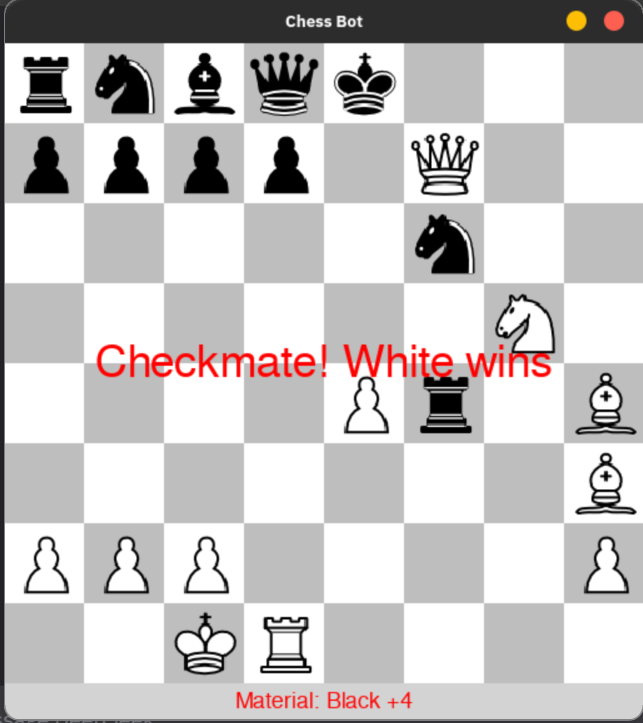

# ♟️ Python Chess Bot with GUI and Opening Book

A beginner-friendly Chess Bot built with **Python**, **Pygame**, and **python-chess**, featuring a clean graphical interface, a Minimax-based AI opponent, and integrated **opening theory** using a Polyglot opening book.

---

## 🚀 Features

- ✔️ Fully playable chess game with GUI (Pygame)
- 🤖 AI opponent powered by Minimax with depth control
- 📘 Opening moves played using a real chess opening book (Polyglot format)
- 🎯 Legal move highlighting
- ⚖️ Material balance display (with color-coded advantage)
- ♟️ Animated piece movement
- ⏱️ Bot move delay for realism
- 🏁 Endgame detection (checkmate, stalemate, etc.)

---

## 🖼️ Screenshots

  <table>
    <tr>
      <td align="center">
        
         
        <em>Main Gameplay</em>
      </td>
      <td align="center">
        
         
        <em>Legal Move Highlighting</em>
      </td>
      <td align="center">
        
         
        <em>Endgame Detection</em>
      </td>
    </tr>
  </table>

---

## 📁 Project Structure
